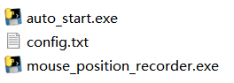
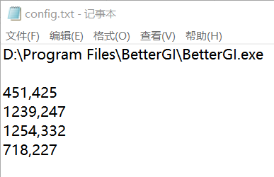

## 介绍

本项目搭配原神自动化脚本BetterGI使用，实现每天定时自动启动BetterGI，并打开原神执行任务（跑狗粮、锄地等）。也完全可以当作一个应用程序 自启动+点击 的脚本（但如果不修改代码的话它会把你的原神进程关掉）。

> 更新：BetterGI官方已给出了命令行参数启动功能https://bettergi.com/feats/command/introduce.html，这样可以在windows任务计划程序里一条命令`/xx/xx/BetterGI.exe start --startGroups xx xx`直接启动任务，而无需其他脚本文件。
>
> 但本项目依旧完善和轻便，且有启动前杀掉原神和BetterGI进程功能（长期执行稳定性会好一点点），且有详细使用教程。可放心食用。

### 原理

使用windows任务计划程序定时启动本项目的脚本，脚本打开BetterGI，并用python的pyautogui操控鼠标点击BetterGI内的按键（需录制）。

### 文件结构

`auto_start.exe`为主脚本，从`config.txt`内读取BetterGI.exe的路径（`config.txt`的第一行）与需要点击的坐标（`config.txt`的第一行以后）。

`mouse_position_recorder.exe`为辅助工具，用于录制点击的屏幕坐标。

### 下载

[release](https://github.com/xishuaige96/autostart-bettergi/releases)

## 使用方法

1. `config.txt`第一行填入要执行程序的位置

2. 运行`mouse_position_recorder.exe`（以管理员身份运行），录制需要点击的坐标，将坐标复制到`config.txt`上。

最终的`config.txt`示例：

3. 此时即可运行`auto_start.exe`（以管理员身份运行），单次自动启动BetterGI。
4. 添加定时功能。把`auto_start.exe`放进windows任务定时程序中（可参考网上的教程或下面的详细使用方法）。注意要点上“使用最高权限运行”。

### 更详细的使用方法

感谢@HRBCNB提供的更详细的使用方法 [使用方法.pdf](使用方法.pdf)
